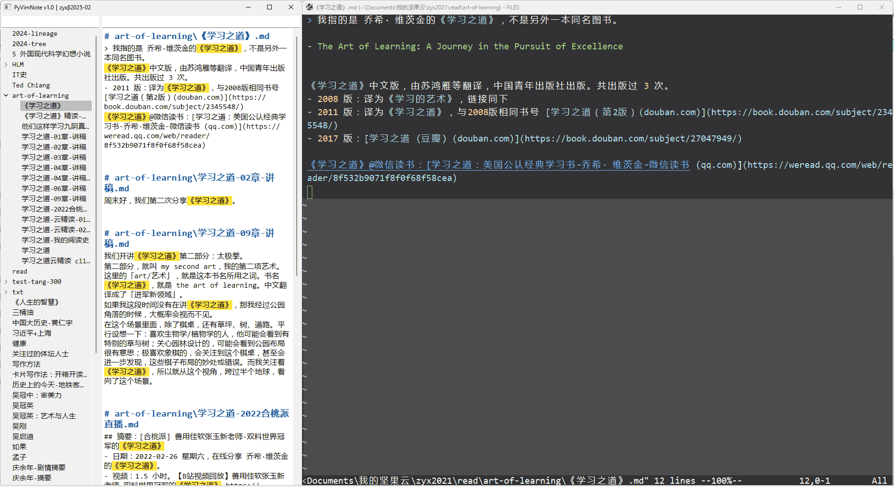

# PyVimNote
- 含义：用 Python 和 Vim 管理 Note (markdown 格式)
- 开发工具：Python
- 开发者：zyxbeta + Cursor
- 版本：v1.0, 2025-02-20
- 说明
	- 自用为主，大概率不符合他人要求
	- AI 写成，代码仅是能用，欢迎随意改进
	- **使用本软件，需要** 
		- 安装有 Python 并有入门基础（比如，依赖库，以及改写代码中的默认笔记库路径）
		- 安装有 gVim（改造后也可调用其他 editor，甚至用 python 把 editor 写在程序里，这样集成性更好）

## 软件界面: Python + Vim
- 右侧 Vim: 用于查看、编辑笔记文件
- 左侧 Python: 目录树功能、双链展示、全文搜索增强
	- 左侧目录树
	- 左上搜索框：对目录树进行实时过滤
	- 右侧编辑区：搜索结果、双链内容
	- 右上搜索框：输入关键词（最多 3 个，空格分开），全文搜索

## 1、使用方法
1. 用户：单击目录树的某文件，比如 学习之道。
2. 软件
	1. 用强大的 gVim 打开此文件，供查看、编辑。
	2. 在搜索区展示所有包括 「学习之道」的内容，相当于全局搜索、双链。
3. 搜索区再操作
	1. 用户单击某条记录，gVim 打开它
	2. 用户双击某条记录，gVim 打开，并且以其标题，刷新搜索结果
4. 其他操作
	1. 目录树上方的搜索框，可以筛选文件
	2. 搜索区上方的搜索框，可以输入关键词（最多 3 个，空格分开），全文搜索
 

